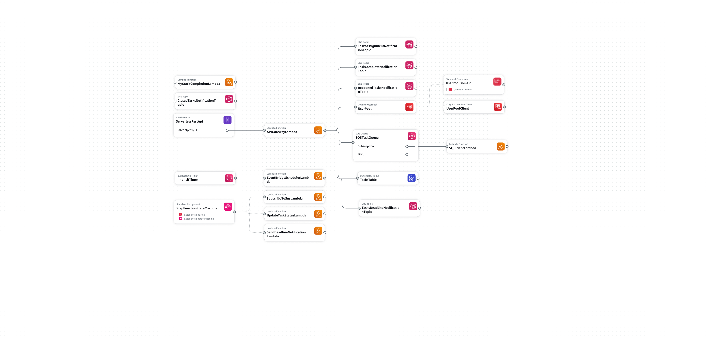

# TASK MANAGER BACKEND APPLICATION
This document provides an overview of the Task Management System for a field team, its architecture, AWS services used, features, and operational details.

## OVERVIEW
The Task Management System enables administrators to create and assign tasks to team members, while allowing team members to view and update their assigned tasks. It leverages AWS serverless services for scalability, efficiency, and ease of maintenance.

### Key features include:
- Task creation, assignment, and tracking.
- Notifications for task assignment, deadlines, status changes, and task reopening.
- Fine-grained access controls for administrators and team members.

## ARCHITECTURE
The system leverages the following AWS services:
1. Amazon Cognito: For user authentication and secure access to AWS backend services.

2. AWS Step Functions: Orchestrates workflows such as subscribing users to SNS topics and handling task deadlines.

3. Amazon SQS: Queue for asynchronous task notifications and deadline processing.

4. Amazon SNS: Email notifications for task events.

5. DynamoDB: Stores tasks details.

6. Lambda Functions: Serverless computing service.

7. UserPool: A user directory in Amazon Cognito that provides user management and authentication functionalities for applications. It stores user profiles and handles sign-up, sign-in, password recovery, and account verification.

8. UserPoolClient: Allows external applications to access a User Pool such as the frontend

9. UserPoolDomain: Provides a URL for accessing the hosted UI for sign-in

10. UserPoolGroup: Allows to group users based on roles



## FEATURES
### Admin Features
1. User Management:
- Create and onboard users via Amazon Cognito User Pool.
- Onboarding email sent to users with a login link.

2. Task Management:
- Create and assign tasks with the following attributes:
  - taskId: Task Id.
  - name: Task name.
  - description: Task details.
  - status: open (default), completed.
  - deadline: Task deadline
  - assignedTo: Assigned user.
  - completedAt: Timestamp when completed.
  - hasSentDeadlineNotification: Determine if deadline notification has been sent
  - userComment: Notes from the assigned user.

3. Task Monitoring:
- View all tasks, their statuses, deadlines, and assigned users.

4. Task Reassignment:
- Update task assignments. The new user receives task details and deadline notification.

5. Reopen Tasks:
- Reopen closed tasks, automatically notifying the assigned user.

### Team Member Features
1. Task Dashboard:
- View individually assigned tasks.

2. Task Updates:
- Update task status (e.g., mark as complete).
- Add comments.

3. Notifications:
- Receive notifications for:
  - Task assignments.
  - Deadline reminders (1 hour before deadline).
  - Reopened tasks.
  - closed tasks


## AWS Setup Guide
1. Amazon Cognito:
- Create a User Pool for authentication.
- Configure an Identity Pool for AWS service access.

2. DynamoDB:
- Create tables and Tasks.

3. Amazon SNS:
- Create topics:
  - TasksAssignmentNotificationTopic
  - TasksDeadlineNotificationTopic
  - ClosedTasksNotificationTopic
  - ReopenedTasksNotificationTopic
  - TaskCompleteNotificationTopic
- Set up email subscriptions.

4. Amazon SQS:
- Create queues for task processing.

5. AWS Step Functions:
- Define workflows for:
  - User onboarding (subscribing users to SNS topics).
  - Task deadline handling.

6. AWS Lambda:
- Implement business logic (e.g., processing SQS messages, updating DynamoDB).

## Lambda functions
- EventBridgeSchedulerLambda: interacts with Amazon DynamoDB and Amazon SQS to manage task notifications. The Lambda function checks tasks in DynamoDB for reminders and deadlines, sends appropriate notifications via Amazon SQS, and updates task statuses in DynamoDB.

- MyStackCompletionLambda: creates admin user and modifies InviteMessageTemplate in the UserPool

- SendDeadlineNotificationLambda: It publishes sns topic to the admin and the individual task has been assigned to. It set subscription filter to ensures only the messages are sent to the admin and assignedTo user.

- SQSEventLambda: It handles SQSEvent. It publishes sns topic to a specific user by applying subscription filter and also handling task deadline by executing step functions.

- StreamLambdaHandler: It handles request from the API Gateway

- SubscribeToSNS: It subscribes users to SNS topics, it is triggered by a Step function

- UpdateTaskStatusLambda: interacts with Amazon Dynamodb to change task status to expires, it is triggered by a Step function

## Security
- Use Amazon Cognito for group-based access control.

## HOW TO DEPLOY THE RESOURCES WITH SAM
- Build the project with Maven or Gradle
```
sam build
```
- Deploy the application
```
sam deploy --guided
```

## ADDITIONAL RESOURCES

### Get Meta-data on your cognito user pool
```
aws cognito-idp describe-user-pool-client --user-pool-id <your-user-pool-id> --client-id <your-client-id>
```

### Get your basic credentials
```
echo -n "<your-client-id>:<your-client-secret>" | base64
```

### Get token
```
curl --location --request POST 'https://<your-user-pool-domain>.auth.<your-aws-region>.amazoncognito.com/oauth2/token' \
--header 'Content-Type: application/x-www-form-urlencoded' \
--header 'Authorization: Basic <your-basic-credentials>' \
--data-urlencode 'grant_type=authorization_code' \
--data-urlencode 'client_id=<your-client-id>' \
--data-urlencode 'code=<your-code>' \
--data-urlencode 'redirect_uri=http://localhost:4200' | jq .

```
